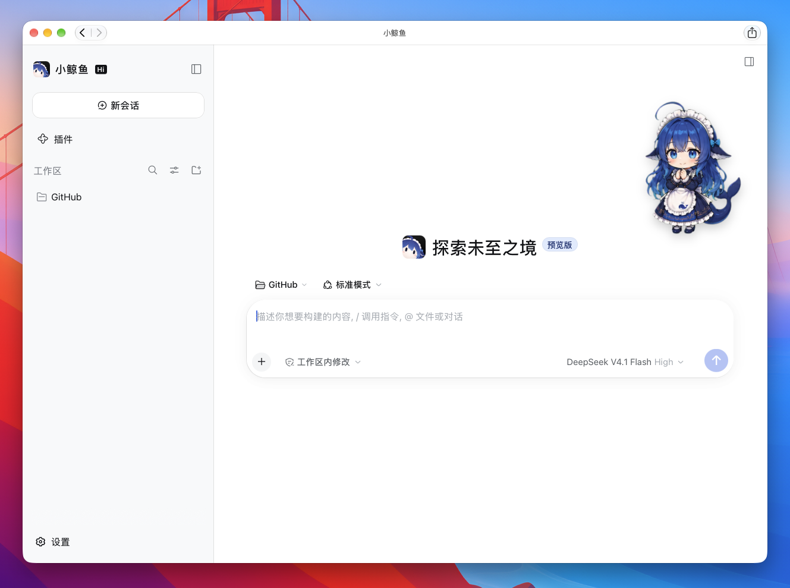
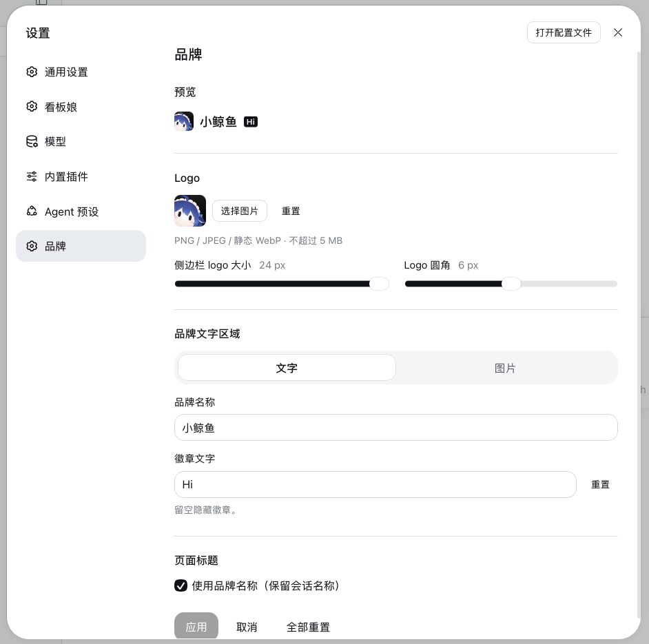

# DSH Brand Studio

[简体中文](https://github.com/qiweiii/dsh-brand-studio#readme) · **English**

A small community plugin for personalizing the branding inside **DeepSeek Harness Web, its PWA, and the desktop app's shared Web UI**, with a dedicated settings panel.

Customize the brand name and badge, choose local logo and wordmark images, preview your changes, and optionally use your brand name in browser titles. Reset restores the official appearance. Desktop window titles follow the shared document title where the shell permits it. Settings stay on the current device and address; they are not synchronized between Web, Desktop, or your phone. Sidebar and new-chat logos use DSH's official UI slots.

This project targets in-app branding. It does not change installed application names, operating-system icons, native desktop menus, or the desktop welcome screen. It is not a theme or character-skin manager.

## Preview

Customize the sidebar logo, name, and badge, along with the new-chat logo and page title. (The character in the screenshot comes from [dsh-whale-musume](https://github.com/Sutera-Diffusus/dsh-whale-musume) and is not included in this plugin.)



Preview changes in **Settings → Branding**, adjust logo size and rounding, and choose a text or image wordmark.



## Installation

In **Desktop**, open the app's **Plugins → Add plugin** dialog. In **Web/PWA**, open the same dialog in the Web interface. Choose either source below.

### npm

Enter this package name:

```text
dsh-brand-studio
```

For Web/PWA, you can also install from the terminal:

```sh
dsh plugin --profile web add dsh-brand-studio
```

### GitHub

Alternatively, enter this repository address:

```text
github:qiweiii/dsh-brand-studio
```

For Web/PWA:

```sh
dsh plugin --profile web add 'github:qiweiii/dsh-brand-studio'
```

After installation, fully quit and reopen **Desktop**, or restart the **Web server** and reload your browser/PWA. Then open **Settings → Branding**.

Desktop and Web use separate profiles; install in each interface you want to customize. A PWA uses its Web server's plugins and needs no separate installation. Manage Desktop plugins through the app's Plugins page; the regular CLI commands above target Web only.

## Usage

Open **Settings → Branding**, edit the name or badge, and choose your images. **Apply** saves the preview; **Cancel** discards pending changes. An empty name restores the official name, and an empty badge hides the badge. **Reset all**, followed by **Apply**, restores all defaults.

Images are processed locally: PNG, JPEG, and static WebP up to 5 MB and 16 megapixels are accepted, then resized to at most 512 pixels per edge. SVG and animated images are rejected. Images and settings are never uploaded by this plugin.

The brand label has **Text / Image** modes; switching modes preserves both choices. The logo also appears in the new-chat view, with adjustable size and rounding.

Page-title customization is enabled by default for new settings and preserves the current session name. Existing saved choices are kept; you can turn it off. Disable other branding/title plugins if they compete for the same area.

### Pair with a custom PWA name and icon

> [!NOTE]
> These steps apply only to a PWA installed from DSH Web, not the official Desktop app.

Use the browser to customize the installed app's name and system icon, and this plugin to customize the branding inside it.

**macOS (Safari, macOS 14 or later)**

1. Open DSH in Safari, choose **File → Add to Dock**, enter an app name, and add it.
2. Open the web app and choose **App name → Settings → General** from the macOS menu bar.
3. Change **Application Name** and click **Icon** to select a local image for the Dock icon. [Apple guide](https://support.apple.com/en-us/104996)

**Windows (Microsoft Edge)**

1. Open DSH in Edge and choose **… → More tools → Apps → Install this site as an app**. Menu locations vary by version.
2. If the installation dialog offers a name field and **Edit** beside the icon, choose your name and image before installing.
3. Open the app's details in `edge://apps` to create a desktop shortcut or pin it to the taskbar. [Edge guide](https://support.microsoft.com/en-us/microsoft-edge/install-manage-or-uninstall-apps-in-microsoft-edge-0c156575-a94a-45e4-a54f-3a84846f6113)

For an existing installation, you can rename its desktop shortcut and select an `.ico` file under **Properties → Shortcut → Change Icon**. This changes the shortcut; the running taskbar icon and registered app name may remain unchanged. If reinstalling to change the name or icon, leave the option to delete app data unchecked when uninstalling. [Windows shortcut guidance](https://learn.microsoft.com/en-us/answers/questions/278976/chromium-edge-install-this-site-as-an-app-modify-i)

### Remove

In Desktop or Web/PWA, open **Plugins**, find **DSH Brand Studio**, choose **Uninstall**, and confirm. To temporarily stop using it, disable it instead.

Development and publishing: [Development](docs/development.md) · [Releases](docs/release.md).

This is an independent community project, not affiliated with DeepSeek.
